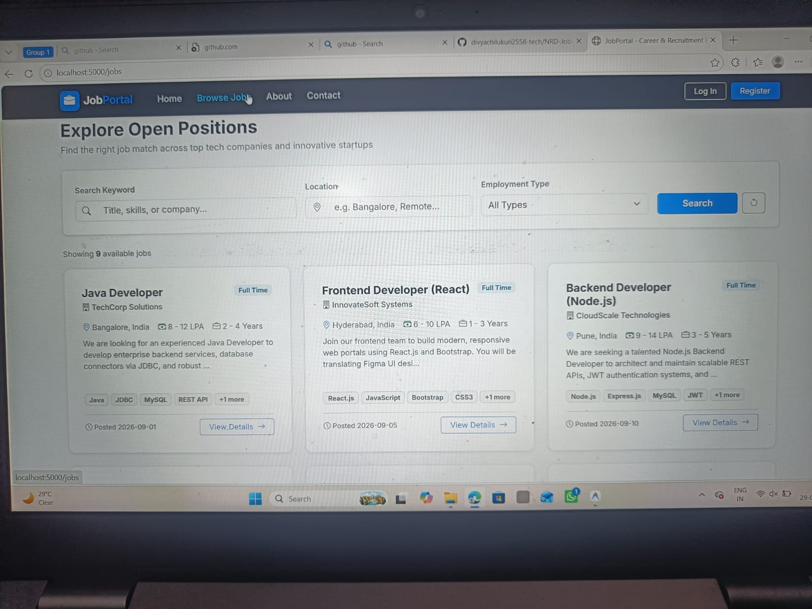
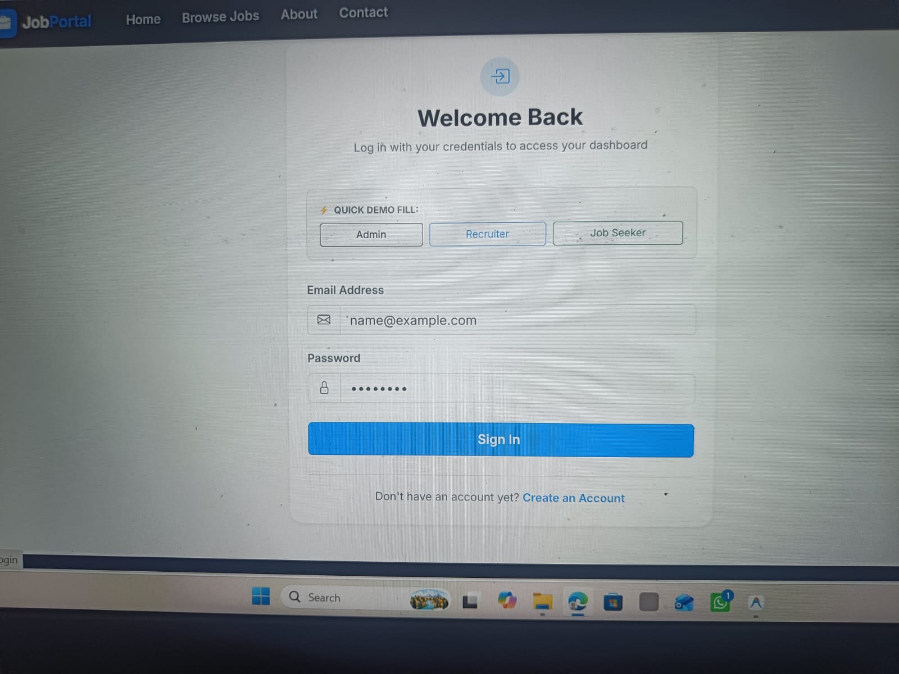

# Job Portal Web Application

A full-stack, enterprise-grade **Job Portal Web Application** designed and implemented in strict compliance with the **NRD Lab curriculum and technology stack** ([saikirandodle/NRD_LAB](https://github.com/saikirandodle/NRD_LAB)).

The portal connects job seekers, employers/recruiters, and platform administrators through a responsive modern interface, authenticated via stateless JSON Web Tokens (JWT), communicating over RESTful APIs, and persisting relational records in a MySQL database.

---

## 🌟 Key Features

### 1. Job Seeker
- **User Authentication**: Secure registration and login with bcrypt-hashed passwords and JWT tokens.
- **Candidate Profile**: View and edit personal profiles, professional headlines, bio, technical skills badges, education history, and work experience.
- **Job Discovery & Search**: Keyword search across titles, skills, and companies with multi-parameter filtering (Location, Employment Type, Experience).
- **Job Details View**: Comprehensive job descriptions, company overviews, salary figures, and deadlines.
- **Application Submission**: One-click application with optional cover note.
- **Duplicate Prevention**: Automated database constraint preventing duplicate applications for the same position.
- **Application Tracking**: Real-time status badges (`Applied`, `Under Review`, `Shortlisted`, `Rejected`, `Selected`).
- **Application Withdrawal**: Safe withdrawal and removal of submitted applications.

### 2. Employer / Recruiter
- **Company Profile**: Dedicated organization branding, company bio, location, and website.
- **Recruiter Dashboard**: Live statistics showing Total Job Postings, Active Postings, Total Applicants, and Shortlisted Candidates.
- **Job Posting Management**: Create, edit, close/reactivate, and delete job postings.
- **Applicant Tracking System (ATS)**: Filter candidates by job and status, search applicants by name and skills.
- **Candidate Profile Inspector**: Modal inspects candidate contact information, resume headline, bio, skills, education, and experience.
- **Status Progression**: Update application stages directly (`Applied` &rarr; `Under Review` &rarr; `Shortlisted` &rarr; `Selected` / `Rejected`).

### 3. Administrator
- **Executive Console**: Global platform statistics and analytics.
- **Data Visualization with Chart.js**:
  - *Jobs by Employment Type* (Doughnut Chart)
  - *Applications by Status* (Bar Chart)
  - *Platform Users by Role* (Pie Chart)
- **User Governance**: Inspect and delete candidate or recruiter accounts with cascade referential integrity.
- **Job Moderation**: Audit all jobs platform-wide and remove inappropriate listings.
- **Application Auditing**: Global real-time audit log of all submitted applications.

---

## 🛠️ Technology Stack

Strict adherence to the NRD Lab repository curriculum:

| Component | Technology | NRD Lab Reference |
| :--- | :--- | :--- |
| **Frontend Framework** | React.js (v18) | Experiment 12 & 14 |
| **Routing** | React Router (v6) | Experiment 12 |
| **UI Design & Styling** | Bootstrap 5.3 & CSS3 | Experiment 1 & 2 |
| **Data Visualization** | Chart.js | Experiment 4 & 13 |
| **Client Validation** | JavaScript ES6+ | Experiment 3 |
| **Backend Runtime** | Node.js (v20) | Experiment 9 |
| **REST API Server** | Express.js | Experiment 10 |
| **Authentication** | JWT (`jsonwebtoken`) & `bcryptjs` | Experiment 11 |
| **Database** | MySQL Relational Database (`mysql2`) | Experiment 5 & 7 |
| **API Testing** | Postman Collection | Experiment 10 & 11 |

*Note: No disallowed frameworks (TypeScript, Next.js, Angular, Vue, Tailwind CSS, Material UI, Prisma, MongoDB, GraphQL, etc.) have been introduced.*

---

## 🏛️ System Architecture

```text
               +------------------------------------------------+
               |           React.js Frontend (SPA)              |
               | (Bootstrap 5.3, CSS3, React Router, Chart.js)  |
               +-----------------------+------------------------+
                                       |
                           HTTP Fetch API (JSON / JWT)
                                       |
                                       v
               +------------------------------------------------+
               |            Express.js REST API Server          |
               | (Port 5000, Auth Middleware, Role Guard, CORS) |
               +-----------------------+------------------------+
                                       |
                            SQL Parameterized Queries
                                       |
                                       v
               +------------------------------------------------+
               |               MySQL Database                   |
               |    (`job_portal` Database on Port 3306)        |
               | (users, job_seekers, recruiters, jobs, apps)   |
               +------------------------------------------------+
```

---

## 📂 Project Structure

```text
job-portal/
├── backend/
│   ├── config/
│   │   ├── auth.config.js          # JWT secret and expiration settings
│   │   └── db.config.js            # MySQL connection credentials and pool config
│   ├── controllers/
│   │   ├── admin.controller.js     # Global metrics and administration
│   │   ├── application.controller.js# Candidate applications and ATS workflow
│   │   ├── auth.controller.js      # User registration, login, and profile lookup
│   │   ├── job.controller.js       # CRUD operations for job postings & filtering
│   │   └── user.controller.js      # User profile updates and user management
│   ├── db/
│   │   ├── db.js                   # MySQL connection pool with resilient fallback
│   │   └── seedData.js             # Realistic sample dataset
│   ├── middleware/
│   │   ├── auth.middleware.js      # JWT token verification (verifyToken)
│   │   └── role.middleware.js      # Role-based access control (authorizeRole)
│   ├── models/
│   │   ├── application.model.js    # Application data model & SQL queries
│   │   ├── job.model.js            # Job posting data model & SQL queries
│   │   ├── jobSeeker.model.js      # Candidate profile data model
│   │   ├── recruiter.model.js      # Employer profile data model
│   │   ├── user.model.js           # User authentication data model
│   │   └── index.js                # Models aggregator export
│   ├── routes/
│   │   ├── admin.routes.js         # /api/admin endpoints
│   │   ├── application.routes.js   # /api/applications endpoints
│   │   ├── auth.routes.js          # /api/auth endpoints
│   │   ├── job.routes.js           # /api/jobs endpoints
│   │   └── user.routes.js          # /api/users endpoints
│   ├── .env                        # Active environment variables
│   ├── .env.example                # Example environment variables
│   ├── package.json                # Express backend dependencies
│   └── server.js                   # Application server entry point
├── database/
│   └── job_portal.sql              # MySQL DDL schema and sample dataset
├── frontend/
│   ├── public/
│   │   └── index.html              # HTML template with Bootstrap 5.3
│   ├── src/
│   │   ├── components/
│   │   │   ├── Footer.js           # Platform footer
│   │   │   ├── JobCard.js          # Reusable job card
│   │   │   ├── Navbar.js           # Role-based responsive navigation
│   │   │   ├── ProtectedRoute.js   # JWT & role route guard
│   │   │   ├── SearchFilter.js     # Search and filter inputs
│   │   │   ├── StatsCard.js        # Dashboard metric badge card
│   │   │   └── StatusBadge.js      # Color-coded status badges
│   │   ├── context/
│   │   │   └── AuthContext.js      # Global authentication state
│   │   ├── pages/
│   │   │   ├── admin/              # Admin dashboard, users, jobs, applications
│   │   │   ├── public/             # Home, Jobs, JobDetails, Login, Register, About, Contact
│   │   │   ├── recruiter/          # Recruiter dashboard, CreateJob, ManageJobs, EditJob, Applications
│   │   │   └── seeker/             # Seeker dashboard, Profile, MyApplications
│   │   ├── services/
│   │   │   └── api.js              # Fetch API client with Bearer headers
│   │   ├── App.js                  # Main routing configuration
│   │   ├── index.css               # Modern custom styles
│   │   └── index.js                # React root mount
│   └── package.json                # Frontend dependencies
├── job_portal_postman_collection.json # Ready-to-import Postman test collection
├── run-backend.bat                 # Convenient Windows backend launcher
├── run-frontend.bat                # Convenient Windows frontend launcher
├── start.bat                       # Single-click launcher for both services
└── README.md                       # Comprehensive project documentation
```

---

## 🗄️ Database Setup (MySQL)

### Database: `job_portal`

To import the database schema and realistic sample data via MySQL CLI:

```bash
mysql -u root -p < database/job_portal.sql
```

Or open `database/job_portal.sql` in **MySQL Workbench** / **phpMyAdmin** and execute the script.

### Relational Schema Summary:
1. **`users`**: `id`, `name`, `email`, `password`, `role`, `phone`, `created_at`
2. **`job_seekers`**: `id`, `user_id` (FK &rarr; `users.id`), `skills`, `education`, `experience`, `resume_headline`, `bio`
3. **`recruiters`**: `id`, `user_id` (FK &rarr; `users.id`), `company_name`, `company_description`, `company_location`, `website`
4. **`jobs`**: `id`, `recruiter_id` (FK &rarr; `recruiters.id`), `title`, `company_name`, `description`, `requirements`, `skills`, `location`, `employment_type`, `salary`, `experience_required`, `posted_date`, `last_date`, `status`
5. **`applications`**: `id`, `job_id` (FK &rarr; `jobs.id`), `seeker_id` (FK &rarr; `job_seekers.id`), `applied_date`, `status`, `cover_note` (*Unique constraint on `job_id` + `seeker_id`*)

---

## ⚙️ Environment Configuration

Create a `.env` file in the `backend/` directory:

```env
# Server Configuration
PORT=5000

# MySQL Database Configuration
DB_HOST=localhost
DB_USER=root
DB_PASSWORD=
DB_NAME=job_portal
DB_PORT=3306

# JWT Authentication
JWT_SECRET=nrd_lab_job_portal_jwt_secret_key_2026
JWT_EXPIRES_IN=24h
```

---

## 🚀 How to Run the Application

### Option 1: One-Click Windows Launcher
Simply double-click `start.bat` in the project root directory. It starts the Express backend and React frontend in separate windows.

### Option 2: Manual Terminal Execution

#### 1. Start Backend:
```bash
cd backend
npm install
node server.js
```
The backend REST API starts on **`http://localhost:5000`**.

#### 2. Start Frontend:
```bash
cd frontend
npm install
npm start
```
The React frontend opens automatically on **`http://localhost:3000`**.

---

## 🔑 Test Credentials (Pre-Seeded)

All demo accounts use password: **`password123`**

| Role | Name | Email | Password |
| :--- | :--- | :--- | :--- |
| **Administrator** | System Administrator | `admin@jobportal.com` | `password123` |
| **Recruiter 1** | Sarah Jenkins (TechCorp) | `sarah.jenkins@techcorp.com` | `password123` |
| **Recruiter 2** | Michael Chang (InnovateSoft) | `michael.chang@innovatesoft.com` | `password123` |
| **Recruiter 3** | Priya Sharma (CloudScale) | `priya.sharma@cloudscale.io` | `password123` |
| **Job Seeker 1** | Alex Morgan (Full Stack) | `alex.morgan@example.com` | `password123` |
| **Job Seeker 2** | Rahul Verma (Java Backend) | `rahul.verma@example.com` | `password123` |
| **Job Seeker 3** | Emily Watson (Frontend) | `emily.watson@example.com` | `password123` |
| **Job Seeker 4** | David Kumar (Data Analyst) | `david.kumar@example.com` | `password123` |

*Tip: The Login page includes **Quick Demo Fill buttons** for 1-click credential filling during testing.*

---

## 📡 REST API Reference

### Authentication
- `POST /api/auth/register` &mdash; Register new user (`seeker` or `recruiter`)
- `POST /api/auth/login` &mdash; Login and obtain JWT token
- `GET /api/auth/me` &mdash; Fetch authenticated profile (Bearer token required)

### Users
- `GET /api/users/profile` &mdash; View current user's profile
- `PUT /api/users/profile` &mdash; Update seeker or recruiter profile details
- `GET /api/users` &mdash; Admin: list all users
- `DELETE /api/users/:id` &mdash; Admin: delete user

### Jobs
- `GET /api/jobs` &mdash; Public: browse jobs with search & filters (`search`, `location`, `employment_type`, `skills`)
- `GET /api/jobs/:id` &mdash; Public: get job details by ID
- `GET /api/jobs/recruiter/my` &mdash; Recruiter: get own job postings
- `POST /api/jobs` &mdash; Recruiter: create new job posting
- `PUT /api/jobs/:id` &mdash; Recruiter/Admin: edit job posting
- `DELETE /api/jobs/:id` &mdash; Recruiter/Admin: delete job posting

### Applications
- `POST /api/applications` &mdash; Seeker: apply for a job (checks duplicate)
- `GET /api/applications/my` &mdash; Seeker: view own applications
- `GET /api/applications/recruiter` &mdash; Recruiter: view all applications across posted jobs
- `GET /api/applications/job/:jobId` &mdash; Recruiter/Admin: view applicants for a job
- `PUT /api/applications/:id/status` &mdash; Recruiter/Admin: update candidate status
- `DELETE /api/applications/:id` &mdash; Seeker: withdraw application

### Admin Analytics
- `GET /api/admin/statistics` &mdash; Platform metrics & Chart.js aggregated datasets
- `GET /api/admin/users` &mdash; Admin: manage users
- `GET /api/admin/jobs` &mdash; Admin: manage platform jobs
- `GET /api/admin/applications` &mdash; Admin: audit applications

---

## 🧪 Postman API Testing

Import `job_portal_postman_collection.json` into Postman to test all endpoints with pre-configured requests and schemas.

---

## 🖼️ Application Screenshots

### 1. Home Page


### 2. Browse Jobs


### 3. Login Page


---

## 🔮 Future Enhancements
- PDF Resume file upload with static file serving
- Email notifications for status changes via SMTP
- Advanced salary filter ranges
- Interview scheduling calendar
